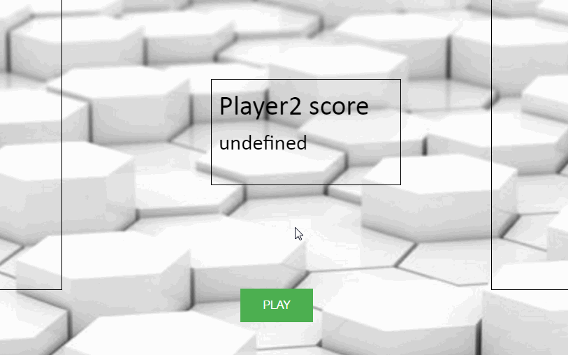

# Seminar Ứng Dụng Phân Tán
**Demo game Xếp hình giới thiệu về Canvas trong HTML5

Danh sách sinh viên: **1312653- Huỳnh Tấn Trực, 1312665-Nguyễn Quốc Tuấn
					   1312676-Đinh Minh Tú , 1312696-Trần Quang Việt**

URL: https://tetris-demo.herokuapp.com/

## Chức năng

Danh sách chức năng cài đặt:

* [x] Xây dựng giao diện cho các thẻ canvas
* [x] Tạo các biến toàn cục, viết hàm khởi tạo giá trị
* [x] Viết hàm tạo Hình mới cho ô gạch
* [x] Viết hàm tạo vòng lập để hiển thị ô gạch rơi xuống và lưu giá trị khi ô gạch chạm đáy
* [x] Viết hàm Vẽ lên các thẻ canvas 
* [X] Viết hàm khai báo các phím trên bàn phím cần sử dụng
* [x] Viết các hàm xử lí sự kiện sử dụng bàn phím
* [x] Viết hàm xoay và di chuyển khối hình
* [x] Viết hàm khi một dòng đầy, sẽ tự động xóa dòng đó.
* [ ] 

Danh sách chức năng **phụ**:

* [x] Chế độ 2 người chơi
* [x] Tính điểm số cho từng người chơi
* [x] Điểm số của mỗi lần xóa dòng được random từ: 95-100
* [x] Khi một người chơi bị thua sẽ dừng trò chơi lại
* [x] Mỗi khi xóa được 1 dòng, tốc độ rơi của khối hình sẽ nhanh hơn.
* [x] Để chơi lại người chơi có thể chọn nút play.

Các chuẩn đầu ra cần thực hiện:
* [ ] Git với Centralize Workflow
* [ ] Git theo Feature Branch Workflow
* [ ] Git theo Feature Branch Workflow có Pull Request
* [x] Git theo Gitflow Workflow

## Video Walkthrough

Here's a walkthrough of implemented user stories:

GIF created with [LiceCap](http://www.cockos.com/licecap/).

## Notes

Describe any challenges encountered while building the app.

## License

    Copyright [yyyy] [name of copyright owner]

    Licensed under the Apache License, Version 2.0 (the "License");
    you may not use this file except in compliance with the License.
    You may obtain a copy of the License at

        http://www.apache.org/licenses/LICENSE-2.0

    Unless required by applicable law or agreed to in writing, software
    distributed under the License is distributed on an "AS IS" BASIS,
    WITHOUT WARRANTIES OR CONDITIONS OF ANY KIND, either express or implied.
    See the License for the specific language governing permissions and
    limitations under the License.